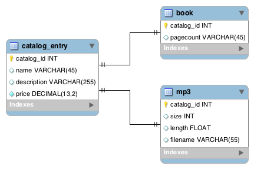
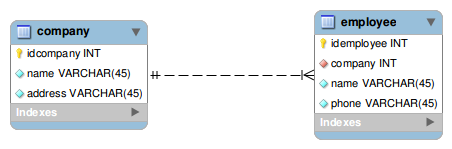

NewObject
==========

É um projeto que viza otimizar a instancia de objetos. 

+ Relacionamento de objetos OneToMany -> Objeto com List ou Objeto com Objeto[];
+ Relacionamento de objetos OneToOne  ->  Objeto com Objeto;

## OneToOne

    
        List<Pessoa> pessoas = (List<Pessoa>) new PersistenceProviderNew().newProvider(1, new Pessoa());

        for (Pessoa p : pessoas){
            System.out.print(p.getId()+" - ");
            System.out.print(p.getNome()+" - ");
            System.out.print(p.getNomeMae()+" - ");
            System.out.print(p.getEnderecos().getId()+" - ");
            System.out.print(p.getEnderecos().getNome()+" - ");
            System.out.print(p.getSobrenome()+" - ");
            System.out.print(p.getTelefone()+"\n");
        }        
        

## OneToMany

    List<Pessoa> pessoas = (List<Pessoa>) new PersistenceProviderNew().newProvider(15,
                new Pessoa(15,"Heverton", "Silva", new Endereco(15, "XXX 03"), "996485605", "Maria", "Jose"));

        for (Pessoa p : pessoas){
            System.out.print(p.getId()+" - ");
            System.out.print(p.getNome()+" - ");
            System.out.print(p.getNomeMae()+" - ");
            System.out.print(p.getEnderecos().getId()+" - ");
            System.out.print(p.getEnderecos().getNome()+" - ");
            System.out.print(p.getSobrenome()+" - ");
            System.out.print(p.getTelefone()+"\n");
        }
        
        OU
        
        List<PessoaList> pessoas = (List<PessoaList>) new PersistenceProviderNew().newProvider(1, new PessoaList());

        for (PessoaList p : pessoas){
            System.out.println(p.getId());
            System.out.println(p.getNome());
            System.out.println(p.getNomeMae());

            for (Endereco end : p.getEnderecos()) {
                System.out.println(end.getId() );
                System.out.println(end.getNome() );
            }

            System.out.println(p.getSobrenome());
            System.out.println(p.getTelefone()+"\n");
        }

## Dependência 

Adicione os comandos no arquivo pom.xml, veja abaixo:

    <repositories>
        <repository>
            <id>newobject</id>
            <url>https://raw.github.com/Heverton/newobject/mvn-repo/</url>
            <snapshots>
                <enabled>true</enabled>
                <updatePolicy>always</updatePolicy>
            </snapshots>
        </repository>
    </repositories>
    
    <dependencies>
        <dependency>
            <groupId>com.pensejava</groupId>
            <artifactId>newobject</artifactId>
            <version>1.0.2</version>
        </dependency>
    </dependencies>

